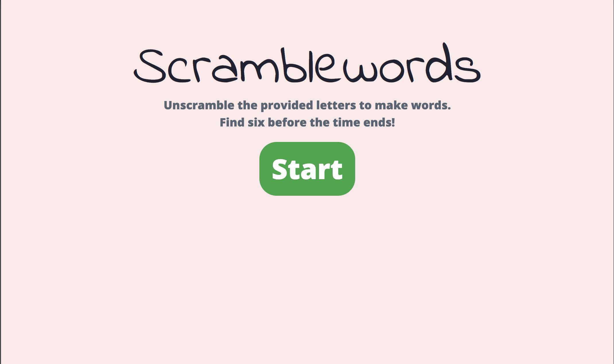
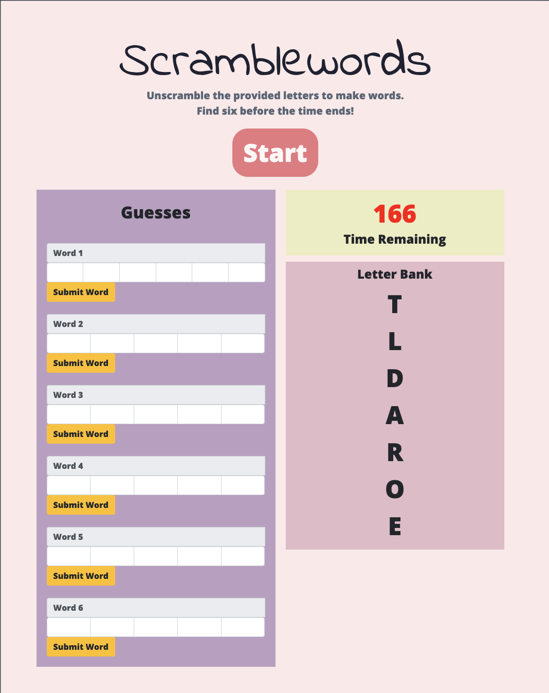

# Scramblewords
A game of vocabularly and quick thinking. Make six words from the letters given to you before the time runs out! Can you make it through all 10 rounds?
## [Play Now](https://ryanjjlee.github.io/scramblewords/)

## Screenshots

## Technologies Used
* HTML & Bootstrap
* CSS
* JS & JQuery

## Getting Started
Click start to begin playing. 

A letter bank will appear and the timer will start counting down. 

Use the letters in the bank to make words that correspond to the lengths of the guess boxes.

Check each word using the _Submit Word_ button.

Submit six correct words before time runs out!

If you win the level, press _New Game_ to go to the next.

## Planned Features
* Add new levels
* Save level progress
* Randomize levels
